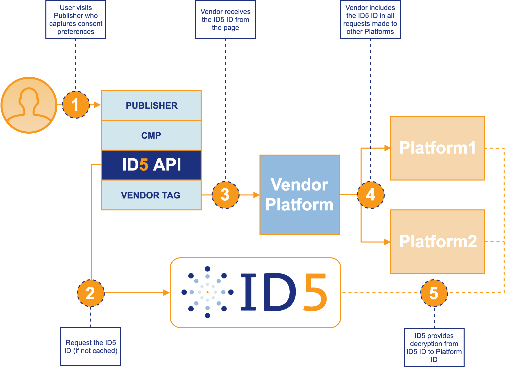

# ID5 Universal ID

The ID5 Universal ID is a shared, neutral identifier that publishers and ad tech platforms can use to recognise users even in environments where 3rd party cookies are not available. ID5 enables publishers to create and distribute a shared 1st party identifier to the entire ecosystem. Ad tech platforms connect with ID5 to decrypt the Universal ID and improve their ability to recognise users. The ID5 Universal ID is designed to respect users' privacy choices and publishers’ preferences throughout the advertising value chain.

# ID5 API Overview

> NOTE: The API is currently in BETA and may have frequent updates while we make improvements prior to releasing `v1.0`

The ID5 API is designed to make accessing the ID5 Universal ID simple for publishers and their ad tech vendors. The lightweight source code handles users’ consent preferences, retrieving, caching, and storing the ID locally, and making it available to other code on the page, including Prebid.js. A flow diagram of how the ID5 API interacts with your CMP and other vendor tags can be [found below](#api-process-flow).

Stay up-to-date with all of our API releases by subscribing to our [release notes](https://id5.io/universal-id/release-notes).

# Table of Contents

- [ID5 Universal ID](#id5-universal-id)
- [ID5 API Overview](#id5-api-overview)
- [Table of Contents](#table-of-contents)
- [Setup and Installation](#setup-and-installation)
  - [ID5 Partner Creation](#id5-partner-creation)
  - [Quick Start](#quick-start)
  - [API Source Code](#api-source-code)
    - [ID5-Hosted Source During BETA](#id5-hosted-source-during-beta)
    - [Pre-built and Minified for Download](#pre-built-and-minified-for-download)
    - [Build from Source (more advanced)](#build-from-source-more-advanced)
  - [Usage](#usage)
    - [Load the API javascript file](#load-the-api-javascript-file)
    - [Initialize the API](#initialize-the-api)
    - [Access the ID5 Universal ID](#access-the-id5-universal-id)
    - [Available Configuration Options](#available-configuration-options)
      - [Generating Publisher Data String](#generating-publisher-data-string)
    - [Available Methods and Variables](#available-methods-and-variables)
    - [Examples](#examples)
    - [Test locally](#test-locally)
  - [Prebid.js](#prebidjs)
- [API Process Flow](#api-process-flow)
- [Benefits of Using the ID5 API](#benefits-of-using-the-id5-api)
- [The GDPR and Privacy](#the-gdpr-and-privacy)
  - [GDPR](#gdpr)
  - [Privacy Policy](#privacy-policy)

# Setup and Installation

## ID5 Partner Creation

The first step to work with the ID5 API and Universal ID is to apply for an ID5 Partner account. If you are not already integrated with ID5, simply go to [id5.io/universal-id](https://id5.io/universal-id) and register for an account.

## Quick Start

<!--Download the latest pre-built, minified version from Github

* [https://github.com/id5io/id5-api.js/releases/download/v0.9.6/id5-api.js](https://github.com/id5io/id5-api.js/releases/download/v0.9.6/id5-api.js)

Install the ID5 API after your CMP (if applicable), but as high in the `HEAD` as possible

```html
<script src="/path/to/js/id5-api.js"></script>
<script>
  ID5.init({partnerId: 173}); // modify with your own partnerId
</script>
```
-->
Install the ID5 API after your CMP (if applicable), but as high in the `HEAD` as possible

```html
<!-- CMP code goes here -->

<script src="https://cdn.id5-sync.com/api/0.9/id5-api.js"></script>
<script>
  ID5.init({partnerId: 173}); // modify with your own partnerId
</script>
```

Retrieve the ID5 ID anywhere on your page

```html
<script>
  var id5Id = ID5.userId;
</script>
```

## API Source Code

> NOTE: While we are still in BETA, we suggest that you pull directly from our [hosted version](#id5-hosted-source-during-beta) until we’re ready to release v1.0. At that time, you should build from source and host it locally on your own CDN.

### ID5-Hosted Source During BETA

During our BETA period, the API should be installed by sourcing the file from our domain:

```html
<script src="https://cdn.id5-sync.com/api/0.9/id5-api.js"></script>
```

This will enable us to make more frequent changes and bug fixes without the need for you to re-build and deploy code on your end. Once the BETA is over, we recommend building from source and hosting on your own CDN instead.


### Pre-built and Minified for Download

You can download the latest release (and host on your own CDN) in a pre-built, minified version from:

* [https://github.com/id5io/id5-api.js/releases/download/v0.9.6/id5-api.js](https://github.com/id5io/id5-api.js/releases/download/v0.9.6/id5-api.js)

### Build from Source (more advanced)

To build a production-ready version of the API from source yourself, follow these steps:

Clone the repository and install dependencies

```bash
$ git clone https://github.com/id5io/id5-api.js id5-api.js
$ cd id5-api
$ npm install
```

*Note*: You need to have `NodeJS 8.9.x` or greater and `Gulp 4.0` or greater installed.

Build for production with gulp

```bash
$ gulp build
```

The resulting minified javascript file will be available in `./build/dist/id5-api.js`.

*Note*: If you build from source, you must use our `gulp build` process as it appends a required variable to the end of the built file. If `ID5.version` is missing, the API will fail to load.

## Usage

There are three main parts to using the ID5 API:

1. Load the javascript file
1. Initialize the API with the partner ID you received from ID5, as well as any other configuration options you’d like to set
1. Access the ID5 Universal ID

### Load the API javascript file

The ID5 API script should be placed as high in the page as possible, but should be after your CMP is loaded & configured (if applicable). By placing this script early in the page, all subsequent scripts on page (including Prebid.js, ad tags, attribution or segment pixels, etc.) can leverage the ID5 Universal ID. You should load the script *synchronously* to ensure that the API is loaded before attempting to call it.

```html
<script src="/path/to/js/id5-api.js"></script>
```

### Initialize the API

After loading the script, you must initialize the API with the `ID5.init()` method. You may pass configuration options directly into the init method.

```html
<script>
  ID5.init({partnerId: 173}); // modify with your own partnerId
  ...
</script>
```

### Access the ID5 Universal ID

Once the API has been loaded and initialized, the ID5 Universal ID can be accessed by any javascript on the page, including Prebid.js, your ad tags, or pixels and scripts from third party vendors, with the ID5.userId variable.

```html
<script>
  ...
  var id5Id = ID5.userId;
</script>
```

The `ID5.userId` variable always exists (once the API is loaded) and will return immediately with a value. If there is no ID available yet, the `ID5.userId` will return a value of `undefined`.

There are a few cases in which `ID5.userId` may not be ready or have a value:

* There is no locally cached version of the ID and no response has been received yet from the ID5 servers (where the ID is generated)
* The CMP has not finished loading or gathering consent from the user, so no ID can be retrieved
* The user has not consented to allowing local storage

### Available Configuration Options

| Option Name | Scope | Type | Default Value | Description |
| --- | --- | --- | --- | --- |
| partnerId | Required | integer | | ID5 Partner ID, received after registration with ID5 |
| allowID5WithoutConsentApi | Optional | boolean | `false` | Allow ID5 to fetch user id even if no consent API |
| cmpApi | Optional | string | `iab` | API to use CMP. As of today, either 'iab' or 'static' |
| consentData | Optional, Required if `cmpApi` is `'static'` | object | | Consent data if `cmpApi` is `'static'`. Object should contain the following:`{ getConsentData: { consentData: <consent_data>, gdprApplies: <true\|false> }}`
| cookieExpirationInSeconds | Optional | integer | `7776000`<br>(90 days) | Expiration of 1st party cookie |
| cookieName | Optional | string | `id5id.1st` | ID5 1st party cookie name |
| debug | Optional | boolean | `false` | Enable verbose debug mode (defaulting to `id5_debug` query string param if present, or `false`) |
| partnerUserId | Optional | string | | User ID of the platform if they are deploying this API on behalf of a publisher, to be used for cookie syncing with ID5 |
| pd | Optional | string | | Publisher-supplied data used for linking ID5 IDs across domains. See [Generating Publisher Data String](#generating-publisher-data-string) below for details on generating the string |
| refreshInSeconds | Optional | integer | `7200`<br>(2 hours) | Refresh period of first-party cookie |
| callback | Optional | function | | Function to call back when `ID5.userId` is available. If `callbackTimeoutInMs` is not provided, `callback` will be fired only if and when `ID5.userId` is available. The callback does not take any parameters |
| callbackTimeoutInMs | Optional | integer | | Delay in ms after which the `callback` is guaranteed to be fired. `ID5.userId` may not be available at this time. |
| tpids | Optional | array | | An array of third party IDs that can be passed to usersync with ID5. Contact your ID5 representative to enable this. |

#### Generating Publisher Data String
The `pd` field (short for Publisher Data) is a base64 encoded string that contains any deterministic user data the publisher has access to. The data will be used strictly to provide better linking of ID5 IDs across domains for improved user identification. If the user has not provided ID5 with a legal basis to process data, the information sent to ID5 will be ignored and neither used nor saved for future requests.

If the publisher does not have any Publisher Data to pass to ID5, the `pd` parameter can be omitted or left with an empty string value (`pd: ""`).

The possible keys in the string are:

| Key | Value |
| --- | --- |
| 0 | other |
| 1 | sha256 hashed email |
| 2 | sha256 hashed phone number |
| 3 | cross-domain publisher user_id value |
| 4 | cross-domain publisher user_id source (value provided by ID5) |
| 5 | publisher user_id value |

To illustrate how to generate the `pd` string, let's use an example. Suppose you have an email address for the user, in this example it is `myuser@domain.com`, and want to share it with ID5 to strengthen the value of the UID we respond with. You also have your own user id for this user that you can share: `ABC123`.

First, perform a sha256 hash of the email, resulting in a string `b50ca08271795a8e7e4012813f23d505193d75c0f2e2bb99baa63aa822f66ed3`

Next, create the raw `pd` string containing the keys `1` (for the hashed email) and `5` (for the publisher user id), separated by `&`’s (the order doesn't matter):

```
1=b50ca08271795a8e7e4012813f23d505193d75c0f2e2bb99baa63aa822f66ed3&5=ABC123
```

Finally, base64 the entire raw pd string, resulting in the final `pd` value:

```
MT1iNTBjYTA4MjcxNzk1YThlN2U0MDEyODEzZjIzZDUwNTE5M2Q3NWMwZjJlMmJiOTliYWE2M2FhODIyZjY2ZWQzJjU9QUJDMTIz
```

This is the value you will add to the config when you initialize the API:

```javascript
ID5.init({
  partnerId: 173, // modify with your own partnerId
  pd: "MT1iNTBjYTA4MjcxNzk1YThlN2U0MDEyODEzZjIzZDUwNTE5M2Q3NWMwZjJlMmJiOTliYWE2M2FhODIyZjY2ZWQzJjU9QUJDMTIz"
});
```

### Available Methods and Variables

| Name | Type | Return Type | Description |
| --- | --- | --- | --- |
| ID5.userId | variable | string | The ID5 Universal ID value. If not set yet, returns `undefined` |
| ID5.linkType | variable | integer | Indicates the type of connection ID5 has made with this ID across domains. Possible values are: `0` = ID5 has not linked this user across domains (i.e. `original_uid` == `universal_uid`); `1` = ID5 has made a probabilistic link to another UID; `2` = ID5 has made a deterministic link to another UID. If `ID5.userId` is not set yet, returns `undefined` |
| ID5.fromCache| variable | boolean | Indicates whether the `ID5.userId` value is from cache (when set to `true`) or from a server response (when set to `false`). If `ID5.userId` is not set yet, returns `undefined` |
| ID5.loaded | variable | boolean | This variable will be set to `true` once the API is loaded and ready for use |
| ID5.initialized | variable | boolean | This variable will be set to `true` once the `init()` method has been called; `false` before |
| ID5.callbackFired | variable | boolean | This variable will be set to `true` once the `callback` function has been scheduled, if applicable; `false` before and if no `callback` is defined |
| ID5.init({}) | method | n/a | Takes a config object as the only parameter and initializes the API with these configuration options |
| ID5.refreshId(boolean, {}) | method | n/a | A method to refresh the ID without reloading the page. Must come _after_ the `init()` method is called. First parameter is a boolean, set to `true` to force a fetch call to ID5, set to `false` to only call ID5 if necessary. The second parameter is a config object to add/change options prior to refreshing the ID. If a callback method is defined in the configuration, it will be called once for `init` and once for every `refreshId` call that is made. |
| ID5.getConfig() | method | object | Returns the entire current configuration object |
| ID5.getProvidedConfig() | method | object | Returns only the specific configuration settings made via `init()` or `setConfig()` |
| ID5.setConfig({}) | method | object | Adds additional configurations to the current configuration object, and returns the updated configuration object |

### Examples

Default configuration options

```html
<script src="/path/to/js/id5-api.js"></script>
<script>
  ID5.init({partnerId: 173}); // modify with your own partnerId

  var id5Id = ID5.userId;
</script>
```

Setting some configuration options at initialization

```html
<script src="/path/to/js/id5-api.js"></script>
<script>
  ID5.init({
    partnerId: 173, // modify with your own partnerId
    refreshInSeconds: 3600,
  });

  var id5Id = ID5.userId;
</script>
```

Using a `callback` method to retrieve the ID5 ID

```html
<script src="/path/to/js/id5-api.js"></script>
<script>
  var id5Callback = function () {
    var id5Id = ID5.userId;

    // do something with the ID5 ID
    fireMyPixel(`https://pixel.url.com?id5id=${id5Id}`);
  };

  ID5.init({
    partnerId: 173, // modify with your own partnerId
    callback: id5Callback
  });
</script>
```

Passing `tpids` to ID5
_(this setting must be enabled by ID5 before we will use the `tpids` array when it's received server side)_

```html
<script src="/path/to/js/id5-api.js"></script>
<script>
  ID5.init({
    partnerId: 173,   // modify with your own partnerId
    tpids: [
      {
        partnerId: 2, // GVL ID of platform who's ID this is
        uid: 'abc123' // platform's ID for this user
      }
    ]
  });

  var id5Id = ID5.userId;
</script>
```

### Test locally

To lint the code

```bash
$ gulp lint
```

To run the unit tests

```bash
$ gulp test
```

To generate and view the code coverage reports

```bash
$ gulp test-coverage
$ gulp view-coverage
```

Build and run the project locally with

```
$ gulp serve
```

This runs `lint` and `test`, then starts a web server at `http://localhost:9999` serving from the project root. Navigate to your example implementation to test, and if your `id5-api.js` file is sourced from the `./build/dev` directory you will have sourcemaps available in your browser's developer tools.

<!--To run the example file, go to:

* `http://localhost:9999/XXXXXX`-->

As you make code changes, the bundles will be rebuilt and the page reloaded automatically.

## Prebid.js

The ID5 API can be used alongside the [User ID module in Prebid.js](http://prebid.org/dev-docs/modules/userId.html#id5-id), allowing publishers to centrally manage the Universal ID while still leveraging Prebid to push the Universal ID to its demand partners.

When deploying the ID5 API alongside Prebid on a webpage, ensure that the following order is maintained when including the code:

1. CMP
1. ID5 API
1. Prebid.js

Within the [Prebid.js configuration for the ID5 ID](http://prebid.org/dev-docs/modules/userId.html#id5-id-configuration), by ensuring the Prebid cookie name (set in `storage.name`) is the same as what is used by the API (optionally set in `cookieName`), the two codebases will work together seamlessly. The default API cookie name is `id5id.1st`, so unless you change that in the configuration of the API, make sure you use the same name when configuring Prebid:

```javascript
pbjs.setConfig({
    usersync: {
        userIds: [{
            name: "id5Id",
            params: {
                partner: 173            // same value as in the API config
            },
            storage: {
                type: "cookie",
                name: "id5id.1st",      // make sure to use the same cookie name as the API, by default it's "id5id.1st"
                expires: 90,
                refreshInSeconds: 2*3600
            }
        }]
    }
});
```

Note that both the User ID module and ID5 submodule must still be included in the Prebid build, even when using the ID5 API to manage the ID5 Universal ID. For more detailed instructions on how to use the ID5 Universal ID in Prebid, refer to [our documentation](https://console.id5.io/docs/public/prebid).

# API Process Flow
Below is an example flow diagram of how the ID5 API interacts with your CMP and other vendor tags.



1. Publisher first loads its CMP and captures the user’s consent preferences. This is essential before any IDs or ads are requested or delivered
1. The ID5 API (or potentially Prebid.js, if the publisher configured their page that way) checks in cache (local storage, 1P or 3P cookies) for an ID5 ID and ensures it is still fresh. If necessary, a request to ID5 is made for a new/refreshed ID, which is then placed in cache to avoid unnecessary http requests on future page views.
1. The Vendor’s tag on the publisher’s page retrieves the ID5 ID via the API and passes it, along with any other information they normally send, to their servers for processing. Examples of Vendor Tags are Prebid.js (or other header bidding solutions), ad tags, attribution or segment pixels, etc.)
1. The Vendor’s servers makes requests to other platforms, including the ID5 ID in addition to, or instead of, the normal user IDs they pass

# Benefits of Using the ID5 API

There are a number of reasons for publishers to use the ID5 API.

* Any platform with tags on the publisher’s page can access the ID5 ID directly without calling ID5’s servers, which reduces the number of HTTP requests required to retrieve the ID5 Universal ID for all platforms, ultimately decreasing page loading time
* The API centrally manages user consent, caching, and ID storage for any platform that needs access to the ID on the page
* Allows for 1st Party storage of the user ID, enabling user identification in browsers that block 3rd Party cookies (like Safari or Firefox) without the need for workarounds that could be blocked with a new release
* With the ID5 Universal ID being consistent and persistent, publishers will earn more revenue from their ad tech platforms through near 100% match rates
* A shared ID eliminates the need for cookie syncing on publisher pages, decreasing page latency
* The API’s code is open-source and available for publisher review (and contribution) here on Github: [https://github.com/id5io/id5-api.js](https://github.com/id5io/id5-api.js) - this means we don’t have any sneaky code doing something publisher’s don’t know about

# The GDPR and Privacy

## GDPR

ID5 has built a privacy-by-design and GDPR-compliant shared ID service for publishers and ad tech vendors. The service leverages the IAB’s Transparency and Consent Framework (TCF) to capture user consent signals.

As a shared ID provider, ID5 acts as a controller of the Universal ID, and thus, we must receive consent to process requests. When we receive a request for the ID5 ID, we check that we have consent to store our user ID in a cookie before proceeding; if we don’t have consent we inform the calling page (through our API) that consent was not received and we do not write a 3rd party cookie as part of the HTTP response.

## Privacy Policy

For our Platform Privacy Policy, please visit [https://id5.io/platform-privacy-policy](https://id5.io/platform-privacy-policy).
